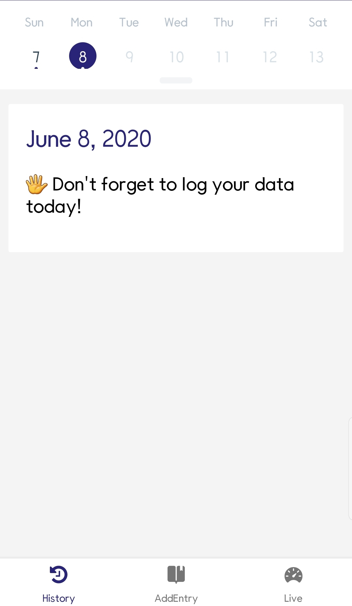
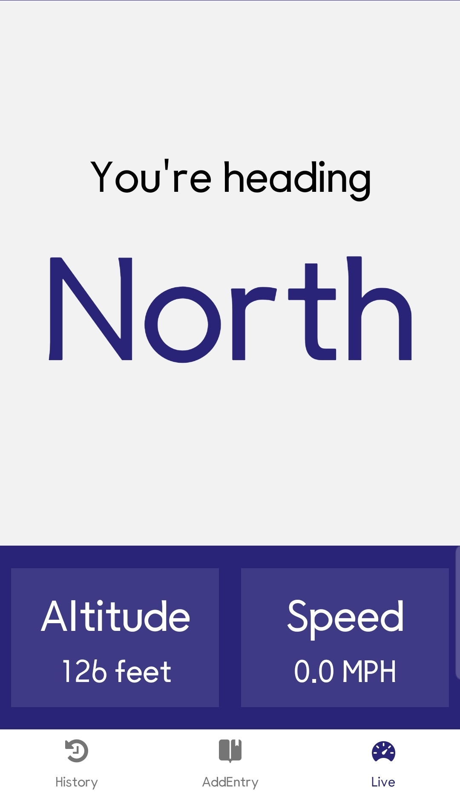
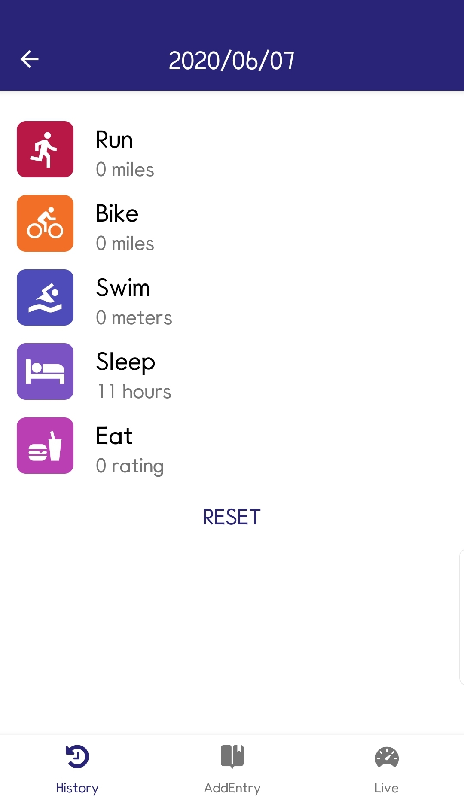
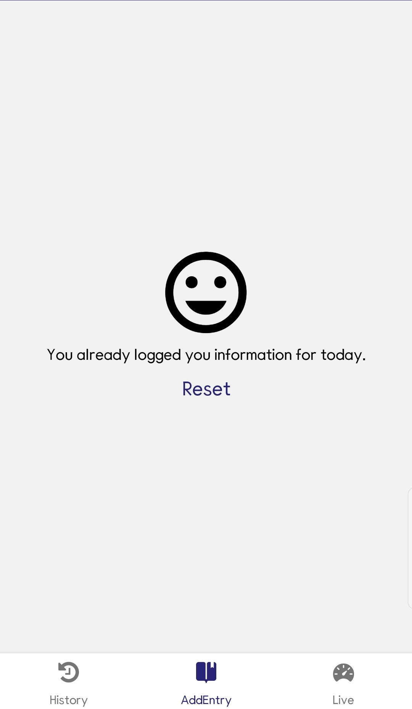
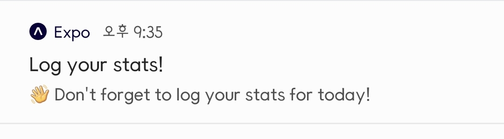

# ⚛Udacity React Nanodegree Project - UdaciFitness🏃‍♂️

Udacity React Native Project - UdaciFitness

# 📷Screenshots

Intro

History

AddEntry

Live

EntryDetail

AddEntry(Reset)

Push Notification

# 🎈Features

- Add Daily Entry
- View History Entries
- Get a Live details about Direction, Altitude, Speed
- View Entry Detail
- Push Notification